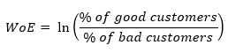

# Capstone : Default Risk Prediction Algorithm for Peer to Peer platform Investor

----------
## Executive Summary

Peer-to-peer lending websites, like Lending Club and RenRenDai (人人贷), connect borrowers directly to lenders, known as investors, who loan money to qualified applicants. It’s an alternative to borrowing money from a bank or a more traditional online lender. Each website sets the rates and the terms (sometimes with investor input) and enables the transaction. 

The best peer-to-peer lending websites offer multiple types of loans and have competitive interest rates and low fees. They have varying minimum and maximum loan amounts and lend money for a variety of different reasons. The best sites have a streamlined application process and highlight their borrower qualifications upfront. 

Although most P2P lending platform provides credit scoring (predict the default risk of borrowers) capability against all borrowers who registered on their platform, it may still be useful to develop a classification model not only to predicts default risk of individual but also to rank order risk so that it can assist sophisticated investor to manage their own risk appetite and allocate lending funds wisely within a diverfied portfolio.  This is also achievable especially with the availability of borrower's credit history and rich source of data on most P2P platform.

As recent as year 2018, due to the tightening of financial regulation as the P2P industry was fast creating a systematic risk in China, alot of P2P platform went out of business.  This episode served as a lesson to most investor and it pays to know the borrower of the platform well.

## Problem Statement

As explained above, with the availability of borrower's credit history data, the goal of the project is to find solutions to the following problem area faced by P2P investor:

1. To build an interpretable classification model, leveraging on P2P platform dataset, that predicts the default risk of each potential borrower and enable investor to make the right funding decision depending on their risk appetite. I will leverage on traditional credit risk model development methodology practised in the financial market for more than 3 decades.

2. Not only focusing on model accuracy, but also emphasize the interpretability of the model by leveraging traditional credit scoring technology.

## Analysis 

For this project, I have used LendingClub dataset for my research and model development work.  The key highlights about the dataset are as follow:

1. Dataset contain borrower status from 2007 to 2014
2. Dataset contain 75 columns with 466285 rows (very rich data)
3. Contain columns with quite a lot of missing value

The below diagram illustrated the yearly volume of loan issued by LendingClub since its launch in year 2007.

## Feature Engineering &  Modelling

<u>Achieving high interpretability of credit risk model</u>

Before proceeding with the actual feature engineering task, I would like to explain some of the approach I have taken to build the risk classification model since these methods were not covered in the GA data science class but are commonly used in the finance industry.
To align with the problem statement, I would like to achieve the following goals:
1. To create a highly interpretable risk classification model so that Lending Club investor can easily understand
2. To create an interpretable risk ranking scorecard so that investor can easily "cherry pick" borrower that match their risk appetite
3. To leverage on this capstone project opportunity to leverage on python to validate some of these existing methods (like weight of evidence) to build the classification model

The below diagram illustrates how a industry analytics vendor, FICO (previously known as Fair Isaac), creates interpretable model to rank order the risk of consumer borrower in US and other markets.  Similarly methodology will be adopted in this project.

#### <u>Classification model to rank order borrower risk:</u>

#### <u>Weight of Evidence Explanation</u>

During the feature engineering phase, weight of evidence will be used to optimize binning of features to achieve rank ordering of credit risk.  The weight of evidence tells the predictive power of an independent variable in relation to the dependent variable. Since it evolved from credit scoring world, it is generally described as a measure of the separation of good and bad customers. "Bad Customers" refers to the customers who defaulted on a loan and "Good Customers" refers to the customers who paid back loan.  The mathematical formula is as follow and it is also illustrated in the diagram below with specific calculation done against "rating" column in the lendingclub dataset.

After doing the relevant WOE analysis, the selected features are used in logistic regression.  As logistic regression is a linear model (it allows the weightage/coefficient of the model to add), I won't be using other model in this project.  The ROC is illustrated below:

Subsequently, the coefficients of the features in the logistic regression model would be scaled from score 100 (minimum score) to 600 (maximum score).  Below illustrates partial scores of features of the end credit scorecard.

## Conclusion

I have achieved most of the objective I have set out to do for this capstone project and with this credit scoring system (leveraging on existing financial industry practices), Lending Club investor has an additional risk assessment tool that enables them to compute a more granular score against potential borrower.  They can then leverage on this score to make a better decision to either fund (with an optimize interest rate) or reject the borrower if they aren't within the risk appetite of the investor.  This serve as an additional insight to the ranking score provided by Lending Club (Grade A to G) which is less granular.
For example, investor can choose a "cutoff score strategy" that suits their risk appetite like the one being taken which is illustrated in the diagram.  Investor can choose to be extremely conservative and accept only borrower with cutoff score of >520 to avoid any nasty delinquent or past due.  However, as you can see from the normal bell curve, fewer borrower will fall into this bucket who are extremely credit worthy and it also mean, only lower interest rate can be offered to the borrower.  To optimize the returns of investor, they can use the scoring tool to traverse down to a lower score to increase their risk appetite, at the same time, potentially improving their return (ability to charge higher interest rate).

With this scoring system, investor can interpret the model easily in the form of a common scorecard and they can also interpret the model at the features or characteristic level.  For example, if the investor want to "loosen up" and accept borrower that has a lower range or bin of annual income, they know "how much decremental score (translated into risk)" they are exposing themselves to if they decide to fund the borrower.

Although both academic and the technology industry have been actively doing and pursuing research in the domain of making AI or machine learning explainable and interpretable, I foresee it will take some time to come up with an alternative XAI approach which replace the existing scoring system widely used in the finance industry, especially regulatory related.
It is also good to understand why in certain financial domain, AI or machine learning technology are widely adopted like in the fraud problem domain.  They are not regulated per se and all loses subjected to fraudulent transaction are solely bank's or finanical institution exposure (hurt their own balance sheet).  Hence, in most cases, this area of application aren't subjected to the same level of scrutiny, as compared to credit assessment system.